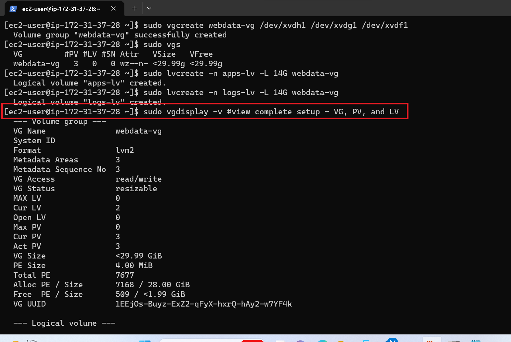

# IMPLEMENTING WORDPRESS WEBSITE WITH LVM STROAGE MANAGEMENT
In implementation it will expose me to a 3 tier architecture and configuring a storage system by working with disks, partitions and volumes using Linux.

This is a two path projects that consist:
1. Configuration of storage system by the use of disk, partitions and volumes for web and database servers on Linux OS.
2. Installing wordpress website and connect it to a remote MySQL database server. (Web and Database tiers)

# Three(3) Tier Architecture
The tree tier architecture is a software application architecture that organises applications into three logical and physical computing tiers which consist of:
* The presentation tier, or user interface, this top-level tier can run on a web browser, as desktop application, or a graphical user interface (GUI), for example
* The application tier, where data is processed; The application tier is typically developed using Python, Java, Perl, PHP or Ruby, and communicates with the data tier using API calls. 
* The data tier, where the data associated with the application is stored and managed. This can be a relational database management system such as PostgreSQL, MySQL.

Three(3) Tier architecture setup.
1. Laptop PC to serve as client
2. EC2 Linux server or webserver
3. EC2 Linux server as a Database(DB) server.

In the course of this project I will be using a Red hat Enterprise Linux 9(HVM) distribution for the both instances.

## Implementing LVM on Linux servers

1. Lunch the EC2 instance using Red hat Enterprise Linux 9(HVM) distribution and SSH from the terminal.

2. Create three(3) EBS(Elastic Block Storage - provides volume storage) of 10GB storage and attach to the Red hat Enterprise Linux 9(HVM) instance.


3. Type `lsblk` to confirm what storage volumes are attached to the server.
`lsblk`


4. Uisng the gdisk cmd to create partitions for all three mounts on the server, remember to type **n,1,w,w,y** for the operation to be successefull.
```
sudo gdisk /dev/xvdf
sudo gdisk /dev/xvdg
sudo gdisk /dev/xvdh
```


5. Run `lsblk` to confirm the partitions are created for each mount.


6. Using the below commands intall the lvm (Logical Volume Manager) package and also check available partitions.
```
sudo yum install lvms
sudo lvmdiskscan
```

7. Use the below command to mark the each of the created disk as physical volumes(PVs) so this can be used by the logical volume manager(LVM)
```
sudo pvcreate /dev/xvdf1
sudo pvcreate /dev/xvdg1
sudo pvcreate /dev/xvdh1
```
8. Add all the created physical volumes (PVs) to a volume group using the below command and verify if it is added successfully.

`sudo vgcreate webdata-vg /dev/xvdh1 /dev/xvdg1 /dev/xvdf1`

`sudo vgs` to verify if added successfully.


9. Use the `lvcreate` utility to create two(2) logical volumes and this will be utilized by the **apps-lv (used to store data for the websites)** and **logs-lv (used to store data for the logs)**
```
sudo lvcreate -n apps-lv -L 14G webdata-vg
sudo lvcreate -n logs-lv -L 14G webdata-vg
```


10. Verify the entire setup by running the below commands.
```
sudo vgdisplay -v #view complete setup - VG, PV, and LV
sudo lsblk 
```



11. Uisng the mkfs.ext4 to format the logical volumes of apps-lv and logs-lv with ext4 file system.
```
sudo mkfs -t ext4 /dev/webdata-vg/apps-lv
sudo mkfs -t ext4 /dev/webdata-vg/logs-lv
```
12. Create a new directory /var/www/html to store website files.
`sudo mkdir -p /var/www/html`

13. Create a new directory /home/recovery/logs to store backup of log data.

`sudo mkdir -p /home/recovery/logs`

14. Mount the created directory for websiter files on apps-lv

`sudo mount /dev/webdata-vg/apps-lv /var/www/html/`

15. Use the **resync** utility to back up all the files in the log directory **/var/log** into **/home/recovery/logs**, this is a required step before mounting the file system as when its mounted the all the existing data will be deleted. 

`sudo rsync -av /var/log/. /home/recovery/logs/`

16. Mount the **/var/log** on **logs-lv** logical volume, at this step all the existing data in the **/var/log** will be deleted that was why its necessary to sync to have a back up of the files before mounting.

`sudo mount /dev/webdata-vg/logs-lv /var/log`

17. Restore the files that are backed up in the **/home/recovery/logs** into the **/var/log** directory.

`sudo rsync -av /home/recovery/logs/log/. /var/log`


18. Use UUID (Universally Unique Identifier) number of the system to update the UUID of **/etc/fstab** file using the below commands and vi editor, after the editing use **:wq!** to save and close the editor.
```
sudo blkid
sudo vi /etc/fstab
```


19. Test the configuration and reload the daemon.
```
sudo mount -a
sudo systemctl daemon-reload
```


# Installing wordpress and configuring to use MySQL Database.
For the DB server I lunched a new EC2 inatance with Red hat Enterprise Linux 9(HVM) and followed all steps as listed above but instead of creating the apps logical volume **apps-lv** I created database logical volume **db-lv** and mount on **/db** directory instead of **/var/www/html/**.

## Installing wordpress on my EC2 Webserver
1. Update the repository using the below command

`sudo yum -y update`


2. Install wget. Apache and its dependencies

`sudo yum -y install wget httpd php php-mysqlnd php-fpm php-jason`

3. Start Apache by using the below command.
```
sudo systemctl enable httpd
sudo systemctl start httpd
```


4. Install PHP and its dependencies
```
sudo yum install https://dl.fedoraproject.org/pub/epel/epel-release-latest-8.noarch.rpm
sudo yum install yum-utils http://rpms.remirepo.net/enterprise/remi-release-8.rpm
sudo yum module list php
sudo yum module reset php
sudo yum module enable php:remi-7.4
sudo yum install php php-opcache php-gd php-curl php-mysqlnd
sudo systemctl start php-fpm
sudo systemctl enable php-fpm
setsebool -P httpd_execmem 1
```


5. Restart apache by running `sudo systemctl restart httpd`

6. Download wordpress and copy wordpress to `var/www/html` file using the below cmds.
```
mkdir wordpress
cd   wordpress
sudo wget http://wordpress.org/latest.tar.gz
sudo tar xzvf latest.tar.gz
sudo rm -rf latest.tar.gz
cp wordpress/wp-config-sample.php wordpress/wp-config.php
cp -R wordpress /var/www/html/
```
7. Configure SELinux policies using the below commands.
```
 sudo chown -R apache:apache /var/www/html/wordpress
 sudo chcon -t httpd_sys_rw_content_t /var/www/html/wordpress -R
 sudo setsebool -P httpd_can_network_connect=1
```

## Installation of my MySQL on my Database (DB) Server.
1. Update, install, enable, restart and verify my MySQL on my DB server using the below cmds.
```
sudo yum update
sudo yum install mysql-server
sudo systemctl restart mysqld
sudo systemctl enable mysqld
```


2. Create a database to work with MySQL following the steps below.
```
sudo mysql
CREATE DATABASE wordpress;
CREATE USER `myuser`@`<Web-Server-Private-IP-Address>` IDENTIFIED BY 'mypass';
GRANT ALL ON wordpress.* TO 'myuser'@'<Web-Server-Private-IP-Address>';
FLUSH PRIVILEGES;
SHOW DATABASES;
exit
```

3. Configure the wordpress to remotely to the database.
In the Inbound rule of DB server instance, I opened port 3306 to allow access to DB server using my Webserver IP.
* Installed MySQL client on my Webserver to allow for remote connection to MySQL on the DB server using the command.

`sudo yum install mysql`

* Exterblished a remote connection from my webserver to MySQL on DB server using the below cmd.

`mysql -h <DB server IP> -u myuser -p`


4. At this point we are done with all necessary configurations but we also need to ensure that port 80 is open on my web server which I did and Used the web server public IP to access the wordpress webpage as seen below.


# **Thank you**


